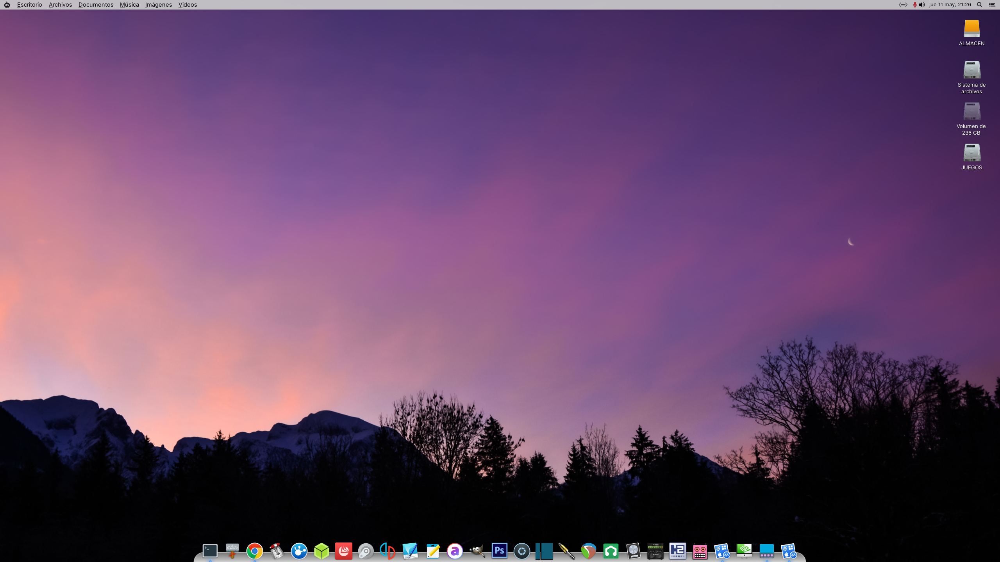

# miloOS



**A professional audio production Linux distribution designed as a macOS replacement.**

miloOS is a complete Debian 13 (Trixie) based operating system optimized for audio production, music creation, and professional audio engineering. Built from the ground up with real-time performance, low-latency audio, and a beautiful macOS-inspired interface.

---

## ⚠️ Important Notice

**This repository contains the core configuration and build system for miloOS distribution.**

- ✅ **Intended for**: Building miloOS ISO images and development
- ❌ **NOT intended for**: Applying to existing production systems
- ⚠️ **Warning**: These scripts modify system files, bootloader, display manager, and core configurations

**Do NOT run these scripts on your production Debian system.** They are designed to build a complete distribution from scratch, not to transform an existing installation.

### Official ISO Releases

Pre-built ISO images will be released when ready. Follow the project for updates:
- **GitHub Releases**: Coming soon
- **Website**: Coming soon
- **Documentation**: Coming soon

---

## Project Vision

miloOS aims to be the **definitive Linux distribution for audio professionals** who want to leave macOS behind without sacrificing workflow, aesthetics, or performance.

### Why miloOS?

**For Audio Professionals:**
- Escape Apple's ecosystem lock-in
- Own your hardware and software
- No forced obsolescence
- Professional audio performance out-of-the-box
- Full JACK compatibility without configuration
- Real-time kernel optimizations

**For macOS Users:**
- Familiar interface and workflow
- San Francisco Pro typography
- macOS-style window management
- Intuitive power management
- Beautiful, polished experience

**For Linux Users:**
- Debian stability and package ecosystem
- XFCE4 performance and customization
- PipeWire modern audio stack
- Open source and transparent
- Community-driven development

---

## Features

### 🎨 Visual Experience

**macOS-Inspired Interface**
- Top panel with application menu integration
- Plank dock with macOS-style animations
- Window buttons in macOS order (Close, Minimize, Maximize)
- Hidden window titles for clean aesthetics
- Desktop icons aligned top-right, vertical layout

**Typography & Theming**
- San Francisco Pro system-wide fonts
- Custom miloOS GTK theme with macOS blue (#007AFF)
- WhiteSur icon theme (macOS Big Sur style)
- Optimized font rendering (antialiasing, hinting, subpixel)
- Custom SLiM login theme

**Visual Polish**
- Custom wallpapers
- Smooth animations
- Consistent color scheme
- Professional appearance

### 🎵 Audio Production Ready

**PipeWire Audio Stack**
- Pre-configured for low-latency audio production
- Sample rates: 44.1kHz to 192kHz
- Buffer sizes: 32 to 1024 samples
- Pro-audio profile by default
- Automatic device configuration

**JACK Compatibility**
- Full JACK support without wrappers
- Works with Reaper, Ardour, Bitwig, Carla
- Automatic library path configuration
- Seamless integration with PipeWire
- No `pw-jack` wrapper needed

**Real-Time Kernel Optimization**
```
preempt=full        # Fully preemptible kernel
nohz_full=all       # No timer ticks on all CPUs
threadirqs          # Threaded interrupt handlers
mitigations=off     # Disabled for maximum performance
```

**System Tuning**
- CPU governor: performance mode
- Real-time priority for audio group (rtprio 99)
- Unlimited locked memory for audio applications
- Optimized I/O scheduler
- Memory management tuning (swappiness, dirty ratios)
- Proactive compaction disabled

**Audio Group Configuration**
- Automatic user setup with real-time privileges
- Nice level -20 for audio processes
- Unlimited file descriptors
- Proper security limits

### 🖥️ System Integration

**Complete Rebranding**
- System identification: miloOS (not Debian)
- Custom GRUB bootloader configuration
- Login banners and MOTD
- LSB release information
- OS release files

**Power Management**
- Custom bilingual dialogs (English/Spanish)
- Shutdown, restart, suspend, logout
- Polkit integration (no password prompts)
- Zenity-based confirmation dialogs
- Seamless user experience

**Display Manager**
- SLiM lightweight login manager
- Custom "milk" theme
- Fast boot times
- Minimal resource usage

**Menu System**
- Custom miloOS system menu
- Separate application menu
- Clean organization
- No duplicate system actions

### 📦 miloApps Suite

Custom applications designed specifically for miloOS:

#### AudioConfig
Professional audio server configuration tool:
- **Sample Rate**: 44.1kHz, 48kHz, 88.2kHz, 96kHz, 192kHz
- **Buffer Size**: 32, 64, 128, 256, 512, 1024 samples
- **Audio Format**: S16LE (16-bit), S24LE (24-bit), S32LE (32-bit), F32LE (32-bit float)
- **Global Configuration**: Controls PipeWire/JACK server parameters
- **Automatic Restart**: Applies changes and restarts PipeWire
- **Bilingual**: English and Spanish interface
- **macOS-Inspired UI**: Clean, simple, elegant

*Note: Device selection is done through XFCE audio plugin. AudioConfig controls only server parameters.*

#### More miloApps Coming Soon
- System monitor
- Backup utility
- Network manager
- And more...

---

## Technical Specifications

### Base System
- **Distribution**: Debian 13 (Trixie)
- **Desktop Environment**: XFCE4
- **Display Manager**: SLiM
- **Audio Server**: PipeWire 1.4+
- **Session Manager**: WirePlumber
- **Init System**: systemd

### Audio Stack
- **PipeWire**: Low-latency audio server
- **PipeWire-JACK**: JACK compatibility layer
- **PipeWire-Pulse**: PulseAudio compatibility
- **WirePlumber**: Session and policy manager
- **RTKit**: Real-time scheduling

### Themes & Icons
- **GTK Theme**: miloOS (custom)
- **Icon Theme**: WhiteSur-light
- **Window Manager Theme**: miloOS (custom)
- **Plank Theme**: milo (custom)
- **Fonts**: San Francisco Pro (Display, Text, Mono)

### Kernel Parameters
```bash
GRUB_CMDLINE_LINUX_DEFAULT="preempt=full nohz_full=all threadirqs mitigations=off"
```

### System Limits
```
@audio   -  rtprio     99
@audio   -  memlock    unlimited
@audio   -  nice      -20
@audio   -  nofile     524288
```

### Sysctl Tuning
```
vm.swappiness = 10
fs.inotify.max_user_watches = 524288
kernel.shmmax = 2147483648
fs.file-max = 524288
```

---

## System Requirements

### Minimum Requirements
- **CPU**: 64-bit processor (x86_64)
- **RAM**: 2GB
- **Storage**: 20GB free disk space
- **Graphics**: 1024x768 resolution
- **Network**: Internet connection for installation

### Recommended Requirements
- **CPU**: Multi-core processor (4+ cores)
- **RAM**: 8GB or more
- **Storage**: 50GB SSD
- **Graphics**: 1920x1080 or higher
- **Audio**: Professional audio interface (optional)

### Supported Hardware
- Most modern x86_64 computers
- Intel and AMD processors
- NVIDIA, AMD, and Intel graphics
- USB and PCIe audio interfaces
- MIDI controllers and devices

---

## Advantages Over macOS

### Freedom & Control
- ✅ Own your hardware forever
- ✅ No forced upgrades or obsolescence
- ✅ Full system access and customization
- ✅ No vendor lock-in
- ✅ Open source transparency

### Performance
- ✅ Lower latency than macOS Core Audio
- ✅ Better resource utilization
- ✅ Optimized for audio production
- ✅ Real-time kernel support
- ✅ No background telemetry

### Cost
- ✅ Free and open source
- ✅ No hardware restrictions
- ✅ Run on any compatible hardware
- ✅ No subscription fees
- ✅ Community support

### Compatibility
- ✅ Native Linux audio tools
- ✅ Windows VST support (via Yabridge)
- ✅ JACK ecosystem
- ✅ LV2 plugins
- ✅ Debian package repository

---

## Advantages Over Other Linux Distros

### Audio-First Design
- ✅ Pre-configured for audio production
- ✅ Real-time kernel parameters
- ✅ Optimized PipeWire configuration
- ✅ JACK works out-of-the-box
- ✅ Professional audio tools included

### Polished Experience
- ✅ macOS-quality interface
- ✅ Consistent design language
- ✅ Custom applications (miloApps)
- ✅ Attention to detail
- ✅ User-friendly workflow

### Debian Stability
- ✅ Rock-solid base system
- ✅ Extensive package repository
- ✅ Long-term support
- ✅ Security updates
- ✅ Proven reliability

### Ready to Use
- ✅ No configuration needed
- ✅ Works immediately after install
- ✅ Sensible defaults
- ✅ Professional appearance
- ✅ Optimized performance

---

## Recommended Software

### Digital Audio Workstations (DAWs)
- **Reaper** - Professional, affordable, cross-platform
- **Ardour** - Open source, full-featured
- **Bitwig Studio** - Modern, innovative
- **Qtractor** - Lightweight, MIDI-focused
- **LMMS** - Free, beginner-friendly

### Audio Tools
- **Carla** - Plugin host and patchbay
- **Helvum** - PipeWire graph manager
- **qpwgraph** - Advanced PipeWire routing
- **Audacity** - Audio editing
- **Guitarix** - Guitar amplifier simulation

### Plugins & Effects
- **Yabridge** - Windows VST bridge
- **Airwindows** - High-quality effects
- **LSP Plugins** - Professional audio plugins
- **Calf Studio Gear** - Vintage-style effects
- **ZynAddSubFX** - Software synthesizer

### Utilities
- **XFCE Audio Plugin** - Built-in volume and device control
- **AudioConfig** - miloOS audio server configuration (included)
- **qpwgraph** - PipeWire graph manager for audio routing

---

## Development Status

### Current Status: Alpha
- ✅ Core system configuration complete
- ✅ Audio optimization implemented
- ✅ Visual theming finished
- ✅ AudioConfig application ready
- ⏳ ISO build system in progress
- ⏳ Additional miloApps in development
- ⏳ Documentation being written

### Roadmap

**Phase 1: Foundation (Current)**
- [x] Base system configuration
- [x] Audio optimization
- [x] Visual theming
- [x] AudioConfig application
- [ ] ISO build system
- [ ] Installation wizard

**Phase 2: Polish**
- [ ] Additional miloApps
- [ ] Complete documentation
- [ ] User testing
- [ ] Bug fixes
- [ ] Performance tuning

**Phase 3: Release**
- [ ] Beta ISO release
- [ ] Community feedback
- [ ] Stable release
- [ ] Website launch
- [ ] Marketing materials

**Phase 4: Growth**
- [ ] Plugin marketplace
- [ ] Cloud sync features
- [ ] Mobile companion app
- [ ] Professional support options
- [ ] Hardware partnerships

---

## License

miloOS Core is released under the **GNU General Public License v3.0**.

See [LICENSE](LICENSE) file for details.

### Third-Party Components
- Debian: Various licenses (mostly GPL, LGPL, BSD)
- XFCE4: GPL-2.0
- PipeWire: MIT
- San Francisco Pro Fonts: Apple (for personal use)
- WhiteSur Icons: GPL-3.0

---

## Credits

### Created By
**Wamphyre** - Project founder and lead developer

### Special Thanks
- Debian Project - Solid foundation
- XFCE Team - Lightweight desktop environment
- PipeWire Developers - Modern audio stack
- Linux Audio Community - Tools and support
- All contributors and testers

### Inspiration
- macOS - Design language and workflow
- Ubuntu Studio - Audio-focused distribution
- KXStudio - Professional audio tools
- Arch Linux - System optimization

---

## Disclaimer

**miloOS is an independent project and is not affiliated with, endorsed by, or associated with Apple Inc.**

- macOS, Mac, and San Francisco are trademarks of Apple Inc.
- miloOS is a Linux distribution inspired by macOS design
- No Apple code or proprietary assets are used
- All trademarks belong to their respective owners

**Use at your own risk.** While miloOS is designed for stability and reliability, the developers are not responsible for any data loss, hardware damage, or other issues that may arise from using this software.

---

## FAQ

**Q: When will the ISO be available?**  
A: We're working on it! Follow the project for updates.

**Q: Can I install this on my existing Debian system?**  
A: No, these scripts are designed for building the distribution, not transforming existing systems.

**Q: Will my audio interface work?**  
A: Most USB and PCIe audio interfaces work with Linux. Check compatibility before installing.

**Q: Can I run Windows plugins?**  
A: Yes, using Yabridge for VST2/VST3 plugins.

**Q: Is this better than Ubuntu Studio?**  
A: Different focus. miloOS prioritizes macOS-like experience and out-of-the-box audio optimization.

**Q: How can I help?**  
A: Test, report bugs, contribute code, write documentation, or spread the word!

---

**miloOS - Professional Audio Production, Beautiful Design, Complete Freedom.**

*Built with ❤️ for audio professionals who demand more.*
