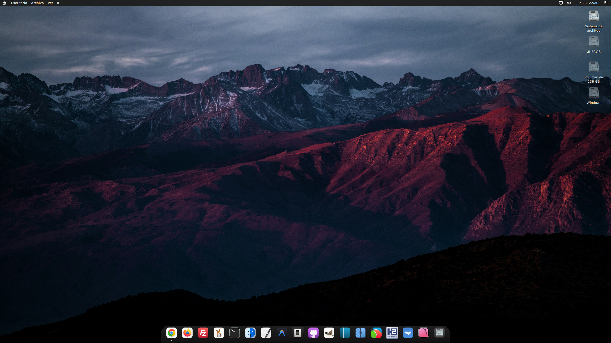

# miloOS



**Transform Debian 13 into a professional audio workstation.**

miloOS is a collection of scripts and configurations that converts a clean Debian 13 (Trixie) installation into an elegant, professional audio production system. No bloat, no complexity—just a refined, ready-to-use creative environment.

---

## What is miloOS?

miloOS is **not a distribution**—it's a transformation kit. Install vanilla Debian 13 with XFCE, run our scripts, and get a complete professional audio workstation with:

- **Optimized kernel** for low-latency audio
- **PipeWire + WirePlumber + JACK** pre-configured and working out-of-the-box
- **Professional audio plugins** (LSP, Calf, x42, ZynAddSubFX, and more)
- **Clean, elegant interface** inspired by professional workflows
- **Custom miloApps** for system management and audio configuration
- **Zero configuration needed**—just install and create

---

## Why miloOS?

### vs. Commercial Systems
- ✅ **No vendor lock-in** - Your system, your rules
- ✅ **No planned obsolescence** - Run on any hardware
- ✅ **No subscription fees** - Free and open source
- ✅ **Complete control** - Customize everything
- ✅ **Better performance** - Optimized for audio, no bloat

### vs. Other Linux Audio Distros
- ✅ **Debian foundation** - Rock-solid stability
- ✅ **Modern audio stack** - PipeWire with full JACK compatibility
- ✅ **Elegant interface** - Professional appearance, not cluttered
- ✅ **Custom tools** - miloApps designed for audio workflows
- ✅ **Simple installation** - One script, done

### The miloOS Difference
- **Professional appearance** - Clean interface that stays out of your way
- **Audio-first design** - Every optimization focused on low-latency performance
- **Thoughtful defaults** - Works immediately, no tweaking required
- **Debian reliability** - Stable base with vast package ecosystem

---

## Features

### 🎵 Professional Audio
- **Real-time kernel parameters** - Fully preemptible kernel, tickless operation
- **PipeWire + WirePlumber** - Modern audio stack with full JACK compatibility
- **Pro-audio profile** - Automatic device configuration for lowest latency
- **Unified audio configuration** - AudioConfig controls PipeWire, WirePlumber, and JACK as a single coherent stack
- **Professional plugins included** - LSP Plugins, Calf, x42, Guitarix, Hydrogen, and more
- **Zero configuration** - Launch your DAW from anywhere, it just works

### 🎨 Elegant Interface
- **Clean design** - Top panel, Plank dock, hidden window titles
- **San Francisco Pro fonts** - Professional typography system-wide
- **WhiteSur icons** - Consistent, modern visual language
- **Custom miloOS and miloOS-Dark themes** - Premium light/dark variants with macOS-style aesthetics and flat titlebars
- **Translucent Plank themes** - Matching light and dark glassmorphic dock themes
- **Distraction-free** - Focus on your work, not the system

### 🛠️ miloApps Suite

**AudioConfig** - Professional audio server configuration
- Single source of truth for the entire audio stack
- Configures PipeWire, WirePlumber, and JACK simultaneously
- Sample rates: 44.1kHz to 192kHz
- Buffer sizes: 32 to 2048 samples
- Audio formats: 16/24/32-bit integer, 32-bit float
- Per-device settings with persistent configuration
- Bilingual interface (English/Spanish)
- macOS Audio MIDI Setup-inspired design

**AudioMaster** - Professional audio mastering tool
- AI-powered audio mastering using Matchering
- Reference-based mastering workflow
- Quality presets: Fast, Balanced, Best
- Normalize and limiter controls
- Supports WAV, FLAC, MP3, OGG, M4A formats
- Bilingual interface (English/Spanish)
- Clean, professional interface

**SysStats** - System statistics and hardware information
- Real-time CPU, memory, disk, and network monitoring
- Hardware details: CPU model, RAM modules, GPU, storage
- Per-core CPU usage visualization
- Network activity graphs
- Process management
- Replaces "About this computer" in system menu
- Bilingual interface (English/Spanish)
- Activity Monitor-inspired design

**miloUpdater** - System update manager
- Check for system updates (apt update)
- Install updates with one click (apt upgrade)
- Real-time terminal output
- Clean, modern interface
- PolicyKit integration for secure authentication
- Bilingual interface (English/Spanish)
- Integrated in XFCE Settings and miloOS menu

**miloThemeDaemon** - System theme synchronization daemon
- Automatically synchronizes GTK, Window Manager (xfwm4), icon themes, application menu logos, and Plank themes
- Optimized using native Python Xfconf bindings to eliminate subprocess spawn overhead
- Detects active theme mode shifts dynamically and handles safe background updates
- Refreshes panel components instantly to guarantee consistent styling

**miloFiles** - Finder-style file manager
- macOS Snow Leopard-inspired interface combined with flat miloOS aesthetics
- Optimized directory listing using `os.scandir` and PyGObject caching to minimize disk lookups
- Bounded thumbnail caching (capped at 1000 items) and throttled processing thread (10ms sleep) to reduce CPU and RAM footprint
- Customizable default open actions (VLC for audio/video, Ristretto for images, Mousepad for text, Firefox/Chrome/Chromium for PDFs)
- Contextual "Open With..." submenu listing MIME-registered apps, and native Gtk.AppChooserDialog integration
- Devices and Favorites sidebar navigation with horizontal size group alignment
- Toggleable Grid/Icon view and Details/List view with custom view switcher icons
- Real-time search filter with keyboard focus event bypass for text entry widgets
- Interactive path bar stack swapping breadcrumbs for an autocompleting URL text entry (Ctrl+L)
- Localized server connection placeholder templates (no hardcoded IPs)
- Full file operations: cut, copy, paste, delete, trash, rename, and properties (Get Info)
- Smart copy-paste filename collision handler (auto-renaming when pasting duplicate files in the same directory)
- Asynchronous folder size calculator in Get Info properties dialog to avoid UI thread blockages
- Integrated multi-format archive compression (.zip, .7z, .tar.gz, .tar.xz, .tar.bz2) and extraction (.zip, .7z, .rar, .tar.gz, etc.) using high-performance native system backends (7z and tar)
- Dynamically adapts to dark and light system themes with customized borderless styling overrides
- Bilingual interface (English/Spanish)


### ⚙️ System Integration
- **Complete rebranding** - System identifies as miloOS
- **SLiM login manager** - Fast, lightweight, custom theme
- **Power management** - Bilingual dialogs, no password prompts
- **Custom menus** - Clean organization, no clutter
- **Automatic user setup** - Real-time privileges, audio group configuration

---

## Installation

### Requirements
- Fresh Debian 13 (Trixie) installation with XFCE desktop
- 20GB free disk space
- Internet connection

### Quick Start

```bash
# Clone the repository
git clone https://github.com/Wamphyre/miloOS-core.git
cd miloOS-core

# Run the installer
./core_install.sh install
```

The script will:
1. Install required packages (PipeWire, WirePlumber, GTK themes, etc.)
2. Configure PipeWire and WirePlumber for real-time audio performance
3. Install professional audio plugins
4. Apply visual themes (including miloOS-Dark and custom Plank layouts), icons, and fonts
5. Install miloApps (AudioConfig, AudioMaster, SysStats, miloUpdater, miloThemeDaemon, and miloFiles)
6. Configure user environment and JACK library paths
7. Optimize kernel parameters and system limits for audio production

**Reboot after installation to apply all changes.**

### Verify Installation

```bash
./verify_installation.sh
```

---

## What's Included

### Audio Plugins
- **LSP Plugins** - 200+ professional effects and processors
- **Calf Studio Gear** - Vintage-style effects
- **x42-plugins** - Professional meters and analyzers
- **Zam Plugins** - Mixing and mastering tools
- **ZynAddSubFX** - Powerful synthesis engine
- **Yoshimi** - Advanced software synthesizer
- **Hydrogen** - Professional drum machine
- **Guitarix** - Guitar amplifier and effects
- **Dragonfly Reverb** - High-quality reverbs
- **Ardour** - Professional DAW

### Multimedia Applications
- **Audacious** - Lightweight music player
- **VLC** - Universal media player
- **GIMP** - Image editing
- **Shotcut** - Video editing
- **DigiKam** - Photo management
- **Upscayl** - AI image upscaler

### System Tools
- **qpwgraph** - PipeWire graph manager
- **GParted** - Partition manager
- **BleachBit** - System cleaner
- **Font Manager** - Typography management

---

## Technical Details

### Audio Stack Architecture

miloOS uses a layered audio configuration where AudioConfig acts as the single source of truth:

```
┌─────────────────────────────────────────────────────────┐
│                    AudioConfig (miloApp)                 │
│          User-facing configuration interface             │
└────────────┬──────────────┬──────────────┬──────────────┘
             │              │              │
             ▼              ▼              ▼
┌────────────────┐ ┌────────────────┐ ┌────────────────────┐
│   PipeWire     │ │     JACK       │ │    WirePlumber     │
│ ~/.config/     │ │ ~/.config/     │ │ ~/.config/         │
│ pipewire/      │ │ pipewire/      │ │ wireplumber/       │
│ pipewire.conf.d│ │ jack.conf.d/   │ │ wireplumber.conf.d/│
│                │ │                │ │                    │
│ • clock.rate   │ │ • node.latency │ │ • audio.format     │
│ • quantum      │ │ • merge-monitor│ │ • audio.rate       │
│ • min/max-q    │ │ • short-name   │ │ • period-size      │
│ • rtkit module │ │                │ │ • headroom         │
└────────────────┘ └────────────────┘ └────────────────────┘
         ▲                  ▲                  ▲
         │    Overrides     │    Overrides      │
         ▼                  ▼                   ▼
┌────────────────┐ ┌────────────────┐ ┌────────────────────┐
│ System defaults│ │ System defaults│ │  System defaults    │
│ /etc/pipewire/ │ │ /etc/pipewire/ │ │  /etc/wireplumber/  │
│ pipewire.conf.d│ │ jack.conf.d/   │ │  wireplumber.conf.d/│
└────────────────┘ └────────────────┘ └────────────────────┘
```

User configs (`~/.config/`) always override system defaults (`/etc/`).

### System Defaults (installed by core_install.sh)

```
PipeWire:    48kHz, quantum=256, min=64, max=2048
WirePlumber: S32LE, period-size=256, headroom=0, pro-audio profile
JACK:        node.latency=256/48000
Kernel:      preempt=full nohz_full=all mitigations=off
Limits:      @audio rtprio=95 memlock=unlimited nice=-20
Sysctl:      vm.swappiness=10 fs.inotify.max_user_watches=524288
```

### Base System
- **OS**: Debian 13 (Trixie)
- **Desktop**: XFCE4
- **Audio**: PipeWire + WirePlumber (with full JACK compatibility)
- **Display Manager**: SLiM
- **Theme**: miloOS & miloOS-Dark custom GTK themes
- **Icons**: WhiteSur-light & WhiteSur-dark
- **Fonts**: San Francisco Pro

---

## Development Status

**Current: Beta**
- ✅ Core system complete
- ✅ Audio optimization implemented
- ✅ Visual theming finished
- ✅ AudioConfig, AudioMaster, SysStats, miloUpdater, and miloThemeDaemon ready
- ✅ Fully refactored for Debian 13 (Trixie) compatibility
- ✅ Unified audio configuration (AudioConfig → PipeWire + WirePlumber + JACK)
- ⏳ Documentation in progress

---

## Support & Community

- **Issues**: [GitHub Issues](https://github.com/Wamphyre/miloOS-core/issues)
- **Discussions**: [GitHub Discussions](https://github.com/Wamphyre/miloOS-core/discussions)
- **Donations**: [Ko-fi](https://ko-fi.com/wamphyre94078) ☕

If you find miloOS useful, consider supporting its development!

---

## License

GNU General Public License v3.0 - See [LICENSE](LICENSE)

### Third-Party Components
- Debian: Various licenses
- XFCE4: GPL-2.0
- PipeWire: MIT
- WirePlumber: MIT
- San Francisco Pro: Apple (personal use)
- WhiteSur Icons: GPL-3.0
- Matchering: GPL-3.0

---

## Credits

**Created by Wamphyre**

Special thanks to:
- Debian Project
- XFCE Team
- PipeWire & WirePlumber Developers
- Linux Audio Community

---

**miloOS - Professional Audio Production Made Simple.**

*Transform Debian into a professional audio workstation in minutes.*
